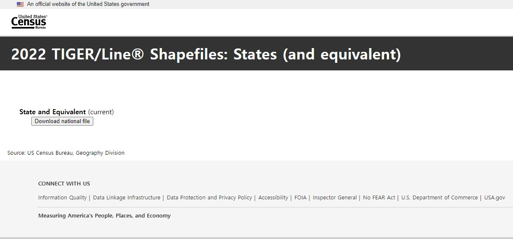
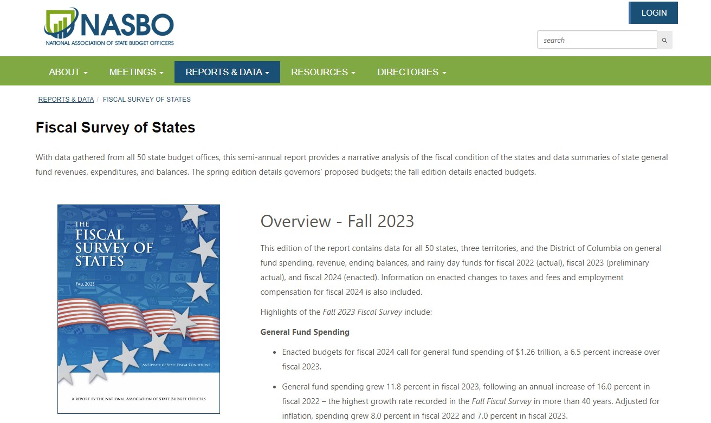
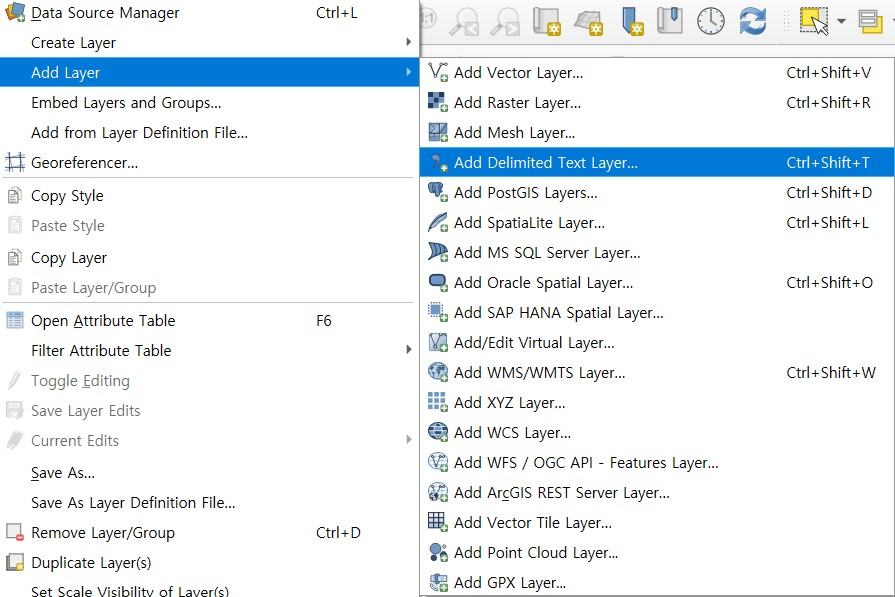
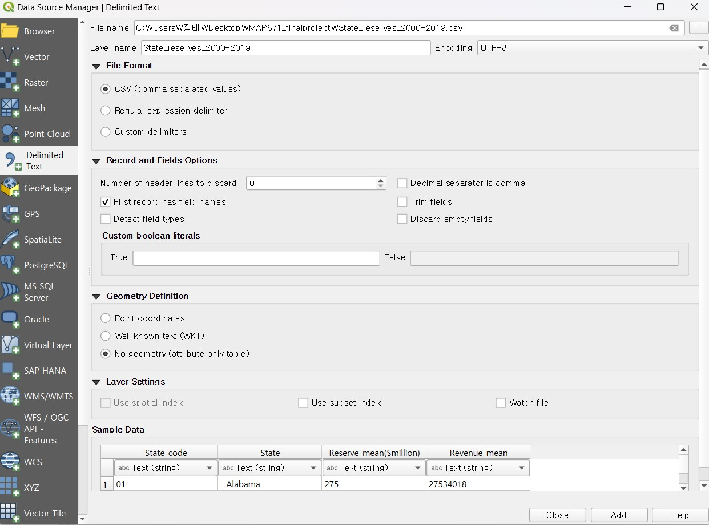
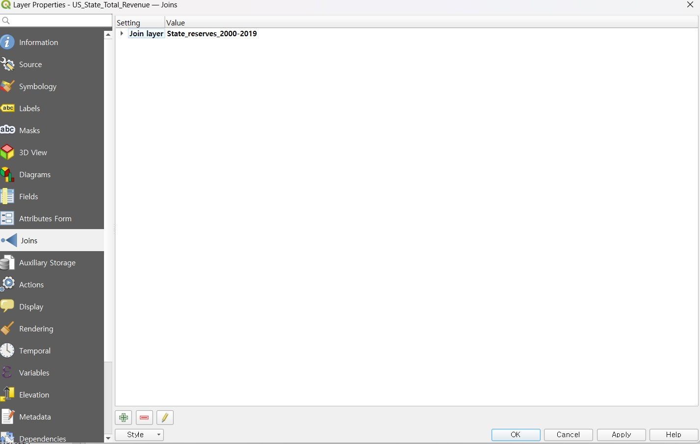
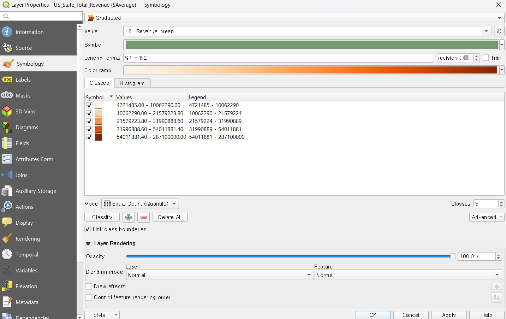

# MAP671_finalproject

This project was developed by Kitae Lee as final project of the UKY MAP 671 Class.

## Project Description
- [Data Source](#data-source)
- [Purpose and Main Result](#purpose-and-main-result)
- [Process of Creating Map](#process-of-creating-map)
- [Project Link](#project-link)

### Data Source

* US State Line: US Census Bureau TIGER Lines (https://www.census.gov/cgi-bin/geo/shapefiles/index.php?year=2022&layergroup=States+%28and+equivalent%29)
* US State Total Revenue: Historical Datasets Fiscal Survey of States in National Association of State Budget Officer (NASBO) (https://www.nasbo.org/reports-data/fiscal-survey-of-states) 
* Map Projection: EPSG 4326

### Purpose and Main Result

Generally, many public budgeting and finance scholars are interested in the financial capacity of government. To assess the financial capacity, scholars have used various indicators, such as total revenue, debt ratio, total balance, etc. Specifically, I’m interested in the total revenue of state government because it can more directly show the financial capacity of government than other indicators. Thus, to study the financial capacity of states, I made this map regarding the total revenue of state government from 2000 to 2019. 
I used the NASBO's historical fiscal survey dataset to create this map, calculating the average total revenue from 2000 to 2019. I excluded Hawaii (HI) and Alaska (AK) due to their extreme total revenue values, applying winsorization in STATA to remove these outliers from the dataset.
According to the results, California has the highest total revenue among the states, while South Dakota has the lowest.

### Process of Creating Map

1. Data collection
Firstly, I collected dataset from the US Census Bureau and NASBO to make the map. 

 

2. Adding the layer
I added the layer of US states border line and the csv dataset regarding the total revenue of state government.

3. Join the datasets
To link two layers (dataset), I joined the US states border layer and the csv dataset of state’s total revenue.

4. Symbolization
I demonstrated the value of total revenue of state government by using gradated method. I chose the 'mean value' variable to use the gradated method. Moreover, I chose the red color variation on the gradated method. Thus, light red color means the small total revenue of states, but dark red color means the large total revenue of state government.

### Final project link

